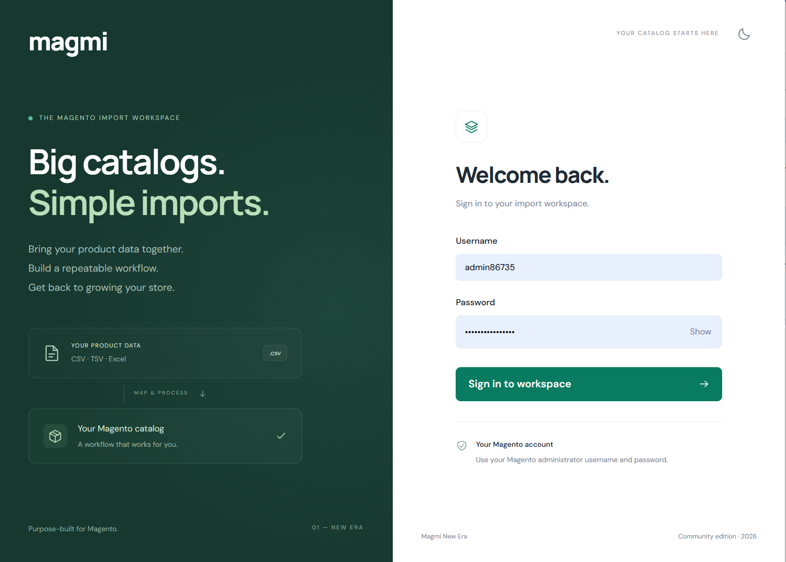
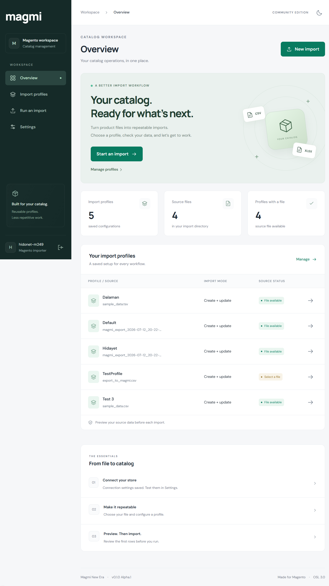
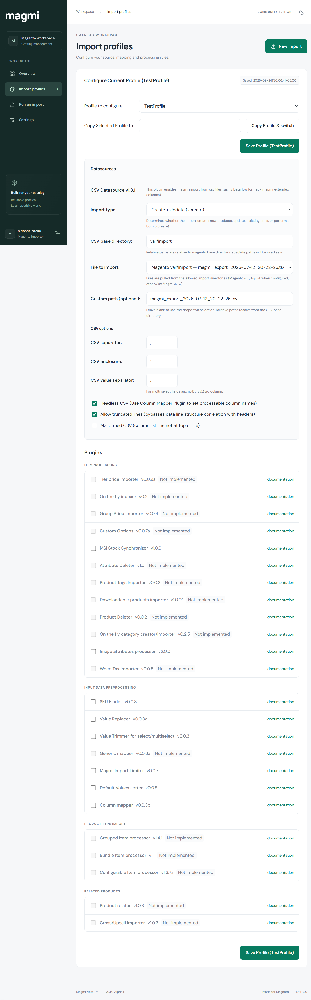
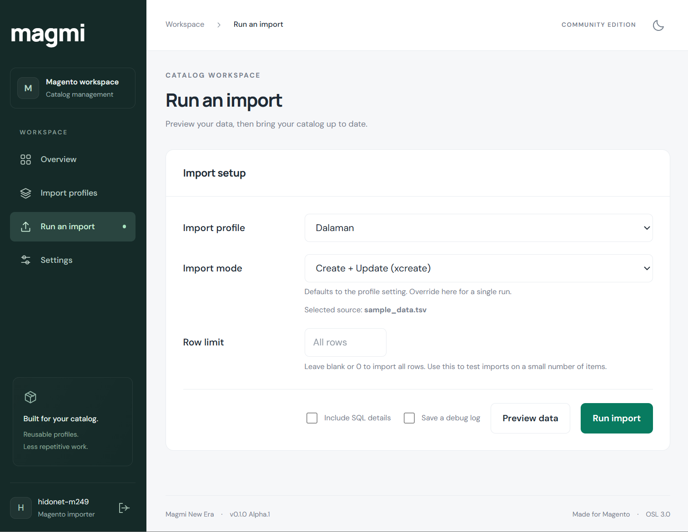
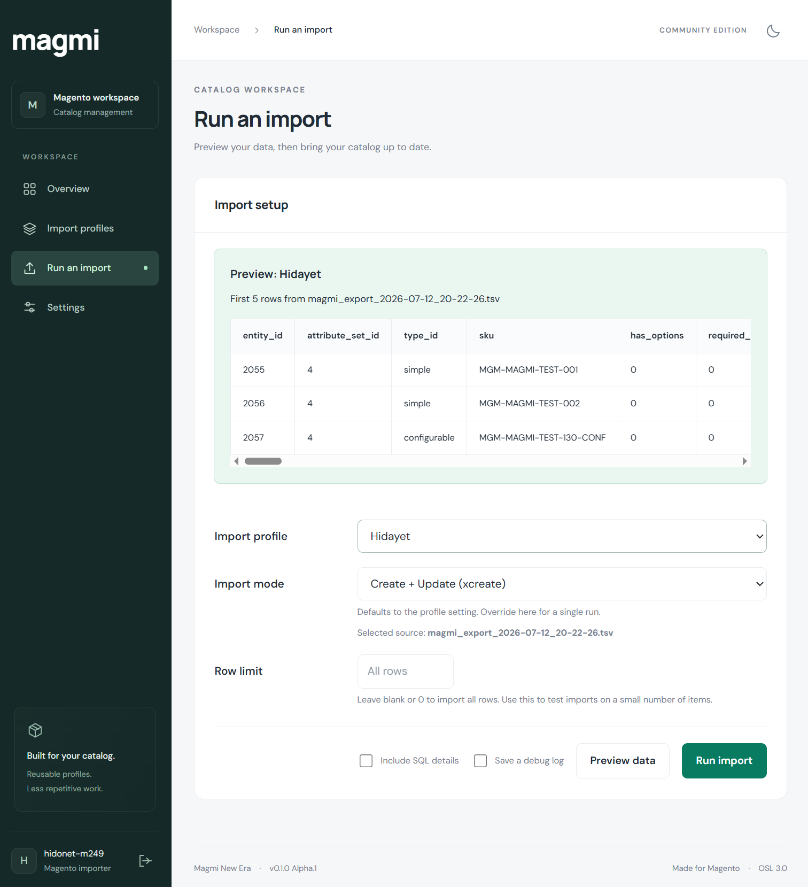
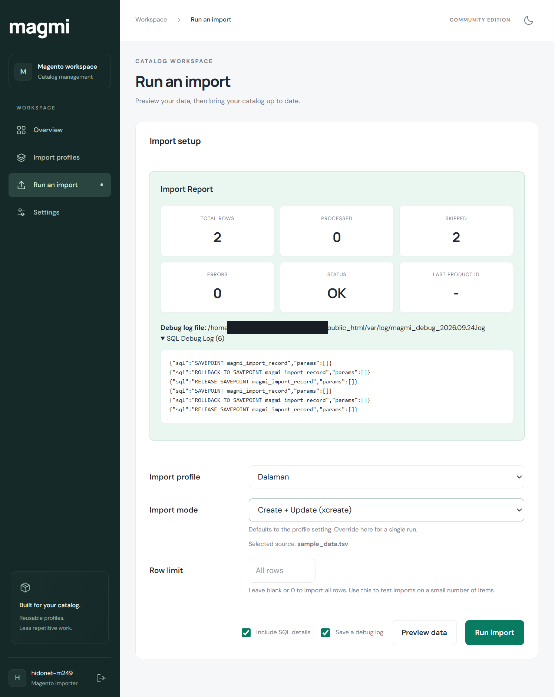
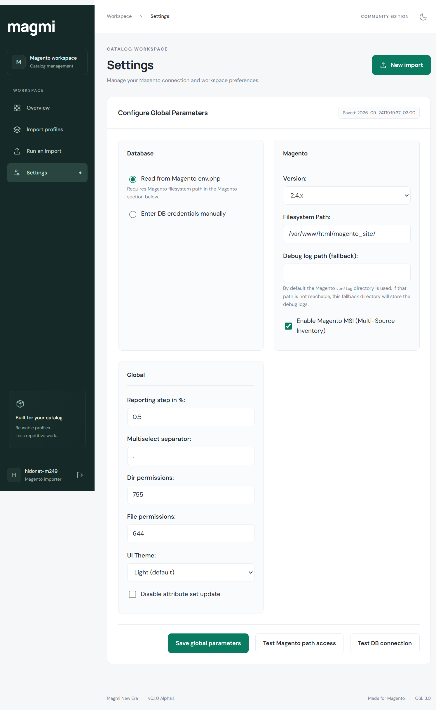

# Web GUI guide

[Installation and updates](../README.md#install) · [Screenshot files](../screenshots)

Screens from Magmi 2 alpha. Profile names, paths and report values are examples from the captured workspace.

[Sign in](#sign-in) · [Overview](#overview) · [Import profiles](#import-profiles) · [Run an import](#run-an-import) · [Preview data](#preview-data) · [Import report](#import-report) · [Settings](#settings)

## Sign in

Open `/login`. On a fresh installation, read the generated credentials from `data/emergency_password.txt` on the server. Once the Magento database connection is available, use your Magento administrator account.

## Overview

See saved profiles, available source files and profiles that still need a file. Open a profile to edit it or start an import.

## Import profiles

Choose the source file, import mode and separator settings, then save the profile. Enable only the plugins you need. Entries marked **Not implemented** are unavailable for imports.

## Run an import

Select a profile and confirm the import mode. Set a small row limit for the first run; blank or zero processes all rows. Preview the data before starting the import.

## Preview data

Check the source columns and sample rows before writing to Magento. A preview reads the file; it does not create or update products.

## Import report

Review processed rows, skipped rows and errors. This example shows two skipped rows and no processed products: an OK status alone does not mean products changed. SQL details and a debug log are optional.

## Settings

Configure the Magento filesystem path and choose whether to read the database connection from `env.php` or enter it manually. Test the path and database connection, then save. MSI, separators, permissions and theme settings are also available here.

After an import, refresh the affected Magento indexes and cache before checking storefront results.
